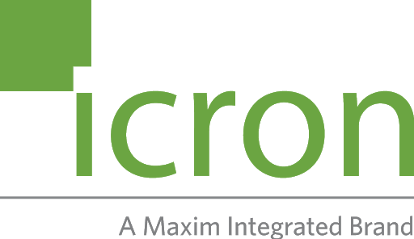

  <strong>
    <a href="http://www.icron.com/">website</a>
  </strong>

<h1 align="center">
  We make USB extenders!
</h1>

Icron is a Maxim Integrated brand, as well as a leading global developer and manufacturer of high-performance USB and video extension solutions for commercial and industrial markets including Medical, Military,  Industrial Automation,  Machine Vision, ProAV, Education, and Mining/Exploration. Icron’s patented extension technology extends USB and video devices over many media types including CAT 5e/6/7, Fiber, Wireless, PowerLine and over a corporate LAN.
Icron Company Overview brochure

## Setup

To be added...